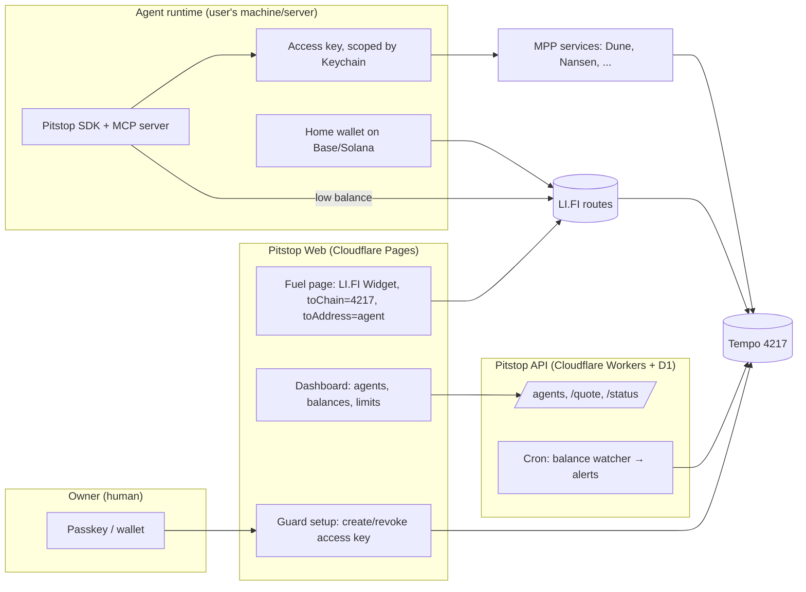

# Pitstop: Project Brief (2026-10-04)

Status: Day 5 demo runs end to end (2026-10-04): Nansen paid over MPP through the guard until blocked; Telegram alerts live. Day 4 done: auto-refill from the agent's Base home wallet and the MCP server (`fuel_agent`) both fuel the guarded wallet on mainnet. Day 3 guard proven on mainnet: the agent's access key is blocked by the protocol (`SpendingLimitExceeded`) once its daily limit is used. Day 2 deployed: https://fuel.pitstopgas.workers.dev serves the fuel page (Base + Solana), the LI.FI proxy and the D1 agent registry. Solana fuel tested with real funds (2 transfers, ~1 s each). Day 1: first real Base → Tempo fuel (see §13). Day 0: monorepo scaffolded, rules confirmed. Deadline: Colosseum Tempo track, **2026-10-12 23:59 PT** (= 2026-10-13 06:59 UTC).
Legend: ✓ = verified on 2026-10-04 · ▲ = not verified yet; confirm before relying on it.

---

## 1. Name

**Pitstop.** An agent pulls into the pit, refuels in about a second, and the pit crew (the guard) enforces the rules.
- Tagline: *"Refuel your agents from any chain."*
- Turkish line: *"Ajanına her zincirden 1 saniyede yakıt."*
- Name availability:
  - npm: `pitstop` is taken; `pitstop-mpp` and `agent-pitstop` are free ✓. Use a scoped package such as `@pitstop/sdk`, or `pitstop-mpp`.
  - Domains: `getpitstop.xyz`, `usepitstop.xyz` and `pitstopmpp.xyz` are free ✓ (~$2 first year at Porkbun, renewal ~$14). `usepitstop.com` is taken.
- Alternatives if the user wants another name: **Pitlane**, **Fuelbay**, **Tankup**.

## 2. Problem
- AI agents pay for APIs per call over MPP on Tempo, for example Dune, Nansen and 137+ other services on mpp.dev ✓. To do that, the agent needs stablecoins on Tempo.
- Most users and agents hold funds elsewhere (Solana, Base, Arbitrum, Ethereum). Today they bridge by hand or fund by card through Tempo's MPP Credits.
- Nothing lets an agent refuel itself from another chain.
- Nothing stops an over-eager agent from draining its wallet.

## 3. Solution

| Part | What it does |
|---|---|
| **Fuel** | Any token on 75 LI.FI chains → USDCe/PathUSD on Tempo, delivered to the agent's address, in about 1–2 seconds |
| **Auto-refill** | When the agent's Tempo balance drops below a floor, its home wallet on another chain tops it up. This runs inside the agent's runtime with its own key, so it is non-custodial |
| **Guard** | The owner signs once with a passkey. The agent gets an Account Keychain access key with a per-period spending cap, a token allowlist and an expiry ▲. Revocable at any time |
| **MCP server** | Tools: `fuel_quote`, `fuel_agent`, `get_balance`, `set_limit`, `revoke_key`, `list_mpp_services` |
| **Dashboard** | Shows agents, balances, spending against the limit, a funding link (any chain), and alerts |

**Difference from what exists:**
- **Tempo MPP Credits:** card funding only, no cross-chain crypto, and no guard ▲.
- **Jumper/LI.FI front-ends:** manual bridging for humans, not agent-native.
- **LI.FI winners** (DISPATCH, ATLAS, Router402): agents use LI.FI, but none has a protocol-level spending guard.

## 4. Verified facts (2026-10-04)

**Live LI.FI quotes into Tempo, $5** (read-only, no transactions):

| Source | Bridge | Received | Time | Gas + fees |
|---|---|---|---|---|
| Base USDC | Across | 4.987 USDCe or PathUSD | ~2 s | ~$0.017 |
| Arbitrum USDC | Across | 4.987 USDCe | ~2 s | ~$0.025 |
| Ethereum USDT | Relay | 4.961 USDCe | ~1 s | ~$0.07 |
| Base ETH | Across | USDCe | ~2 s | ~$0.03 |
| Solana USDC | Relay | 4.966 USDCe | ~1 s | ~$0.03 |

**Tempo:**
- Chain ID **4217** ✓.
- RPCs: `https://rpc.mainnet.tempo.xyz`, `https://tempo-mainnet.drpc.org`, `https://tempo-rpc.publicnode.com` ✓.
- Gas is paid in stablecoins (~$0.00003–0.001 per transaction).
- Native features: passkeys, `feePayer` sponsorship, 2D/expiring nonces, TIP-20 memos, Account Keychain access keys, MPP sessions.

**TIP-20 tokens on Tempo, from the LI.FI token list:**

| Token | Address |
|---|---|
| PathUSD | `0x20C0000000000000000000000000000000000000` |
| USDCe | `0x20C000000000000000000000b9537d11c60E8b50` |
| USDT0 | `0x20C00000000000000000000014f22CA97301EB73` |
| USD1 | `0x20C000000000000000000000111111111E910F0f` |

frxUSD, USDe, cbBTC and others are also available.

**LI.FI:**
- 75 chains, including Tempo, Solana, Tron and Bitcoin ✓.
- Without a key: 75 `/quote` calls per 2 hours. With a key: 100/min. Get a key and set up the fee wallet at https://portal.li.fi.
- Integrator fee: the `fee` parameter is a decimal (0.003 = 0.3%), plus the `integrator` name. LI.FI may take a share.
- MCP: `https://mcp.li.quest/mcp`.
- SDK: `@lifi/sdk`, using `executeRoute` with `updateRouteHook`. Widget: `@lifi/widget`, which supports EVM and Solana wallets.

**Colosseum rules** (official rules PDF, read 2026-10-04 ✓):
- Contest runs 2026-09-14 06:00 PT → **2026-10-12 23:59 PT**. Every team member must register on colosseum.com before then; the team leader uploads the submission.
- One team per entrant; a team may submit one project at a time.
- Tempo track: $100,000 across 10 products "that integrate with the Tempo blockchain". The rules don't require mainnet or set a video length; check the submission form for those.
- Judging: functionality and code quality, potential impact, novelty, UX, **open source and composability**, business plan.
- All content must be in English. Winners announced by 2026-12-05.

**viem already supports Tempo** (viem 2.57.2 ✓):
- `import { tempo } from 'viem/chains'` (id 4217, default RPC `https://rpc.tempo.xyz`, explorer `https://explore.tempo.xyz`).
- `viem/tempo` exports `Actions.accessKey.*`: `authorize` (with `expiry`, `limits: [{ token, limit, period }]`, `scopes` = call allowlist with optional `recipients`), `getMetadata`, `getRemainingLimit`, `updateLimit`, `revoke`. Plus `Scopes`, `Expiry`, `WebAuthnP256` (passkeys) and `Actions.token.*`.
- Account Keychain precompile: `0xaAAAaaAA00000000000000000000000000000000`.
- All four RPCs answer `eth_chainId = 4217`: `rpc.tempo.xyz`, `rpc.mainnet.tempo.xyz`, `tempo-rpc.publicnode.com`, `tempo-mainnet.drpc.org` ✓.

**Tooling:** `@lifi/sdk` is now v4.10 (check whether `executeRoute`/`updateRouteHook` changed on Day 1 ▲). TypeScript `latest` is 7.0 (native); packages build with plain `tsc`. pnpm 12 runs via corepack; `allowBuilds` in `pnpm-workspace.yaml` permits esbuild and workerd install scripts.

**Consumers of MPP:**
- Dune MPP: session deposit of about $10; `sql/execute` costs $0.05–4.
- Nansen MPP: chainId 4217; each call is signed separately; $0.01–0.05 per call.
- Service directory: https://mpp.dev/api/services (137 services).

## 5. Architecture



**Where the keys live:**
- The Pitstop server holds no private keys.
- The owner signs guard setup with a passkey in the browser.
- The agent's runtime holds its own scoped access key and its home-wallet key, and runs auto-refill locally.

## 6. Tech stack

| Layer | Choice | Cost |
|---|---|---|
| Language | TypeScript, pnpm monorepo | $0 |
| Chain | `viem` (Tempo chain definition; check whether viem ships it ▲, otherwise define it), Tempo SDK/`mppx` for MPP | $0 |
| Routing | `@lifi/sdk`, `@lifi/widget` | $0 + gas |
| Web | Vite + React on Cloudflare Pages (`*.pages.dev` until a domain is bought) | $0 |
| API | Hono on Cloudflare Workers, D1, Cron Triggers | $0 (or $5 if the free CPU limit is hit) |
| MCP | `@modelcontextprotocol/sdk` (stdio and HTTP) | $0 |
| Alerts | Telegram bot (grammY) via a Worker webhook | $0 |
| RPC | PublicNode, dRPC, Tempo's official RPC | $0 |

**Monorepo layout:**
```
pitstop/
  packages/sdk/      # fuel(), getBalance(), autoRefill(), guard helpers
  packages/mcp/      # MCP server wrapping the SDK
  apps/web/          # fuel page + dashboard + guard setup
  apps/api/          # Workers API + cron watcher + Telegram alerts
  examples/demo-agent/  # Solana → Tempo refuel, pays Dune + Nansen, hits limit
  docs/
```

## 7. Build plan (10-04 → 10-12)

| Day | Date | Work | Done when |
|---|---|---|---|
| 0 | 10-04 | Re-check Colosseum rules and deadline. Scaffold the monorepo. User: LI.FI portal key + fee wallet, Tempo wallet, test funds ($20–40) | `pnpm build` passes; rules confirmed |
| 1 | 10-05 | SDK `fuelQuote` / `fuel` (LI.FI → Tempo, `toAddress`) and `getBalance` (TIP-20) | Real $2 Base → Tempo transfer works from a script |
| 2 | 10-06 | Web fuel page (Widget pre-set to Tempo + agent address) + agent registry API (D1) | A funding link works from Solana and Base |
| 3 | 10-07 | Guard: research the Account Keychain API, then create, limit and revoke access keys from the web with a passkey | The agent is blocked when it exceeds its daily cap |
| 4 | 10-08 | Auto-refill in the SDK (threshold + home wallet) and the MCP server tools | Claude/Cursor can call `fuel_agent` |
| 5 | 10-09 | Demo agent: Solana → Tempo refuel, pays Dune (MPP) and Nansen (MPP), hits the limit. Cron watcher + Telegram alert | End-to-end demo runs |
| 6 | 10-10 | Dashboard polish, README, landing page, integrator fee on | Public URL works |
| 7 | 10-11 | Demo video (2–3 min), submission text, buffer | Draft submission ready |
| — | 10-12 | **The user submits** | — |

## 8. Who does what
- **Claude:** code, tests, architecture, README, submission text draft, video script.
- **User:**
  - Accounts: Colosseum, LI.FI portal, Cloudflare, domain, Telegram bot token.
  - Wallets and funding: Solana, Base and Tempo wallets.
  - Signing every transaction, recording the video, and submitting.

## 9. Costs

| Item | Cost |
|---|---|
| Domain (`getpitstop.xyz`) | ~$2 first year (optional; `pages.dev` is free) |
| Test transfers | ~$20–40; the money is not spent, it moves between your wallets |
| Dune MPP session deposit | ~$10 (refundable when the session closes) |
| Nansen MPP calls for the demo | ~$1 |
| Hosting, RPC, LLM | $0 |
| **Total** | **~$35–55**, most of it recoverable |
| Monthly after launch | $0–5 |

## 10. Risks and open questions
- ✓ **Account Keychain (tested 2026-10-04):** limits are enforced by the protocol; fees paid in the limited token count against the limit (plan a small buffer, or sponsor fees with `feePayer`). Browser EVM wallets (Rabby/MetaMask) cannot sign key authorizations (raw-hash signature on a Tempo tx), so the wallet root is a passkey. `mppx` supports access-key accounts, and a real Nansen payment confirmed MPP spends count against the limit.
- (old note) Account Keychain was mostly answered by viem (see §4): a precompile, per-token limits with a period, expiry, call scopes with recipient allowlists, `updateLimit` and `revoke`. Still open: whether MPP clients (`mppx`) can sign with an access key, so payments count against its limit. Test on Day 3. If not, fall back to a guard contract or an off-chain policy in the SDK.
- ✓ **Colosseum rules:** confirmed (see §4). Still open: the submission form's fields (video length, repo link, mainnet proof).
- ▲ **Tempo MPP Credits overlap:** check what it covers and position Pitstop as crypto-native, cross-chain and guarded.
- ✓ **viem / Tempo SDK:** viem ships the chain definition, TIP-20 actions and access-key actions.
- **LI.FI:** rate limits without a key (75 quotes per 2 h), so get a key. Small-amount route minimums.
- **Solana:** wallet signing in the Widget works for Solana. Auto-refill from Solana in the SDK needs `@solana/web3.js` support in `@lifi/sdk` ▲.
- **Legal:** stay non-custodial and never hold user funds.

## 11. Bonus fits (same product)
- **LI.FI Builders Program:** $5k per quarter. LI.FI's winning pattern is an agent with LI.FI as the execution layer.
- **Nansen:** a "Nansen agent fuel" preset; Nansen buildathon later.
- **Builder-reward angle:** real MPP spend on Tempo, LI.FI integrator volume, and an open-source SDK and MCP server.

## 12. Background
Pitstop came out of a 9-network product research session on 2026-10-04: Base, Arc, Tempo, Polymarket, Fhenix, Nansen, LI.FI, Dune and Ritual. In the ranking it was the top-tier idea "MPP Tank" (score 400), combined with the LI.FI-winner-pattern "guarded agent" (L6).

Reports on the Desktop:
- `urun-fikirleri-tumu-2026-10-04.md` / `.pdf`
- `urun-fikirleri-tur2-2026-10-04.md`
- `lifi-kazanan-analizi-2026-10-04.md`

## 13. Mainnet log

| Date | What | Result |
|---|---|---|
| 2026-10-04 | Day 5 demo: owner set the key limit to 0.05 on /guard; `pnpm demo` | Nansen token info paid 4× ($0.01 each, HTTP 200: USDC, WETH, LINK, UNI), 5th call **BLOCKED by the guard: SpendingLimitExceeded** (left $0.0099). Telegram bot @pitstop_alert_bot: webhook on the Worker (secret-checked, 403 otherwise), `/watch <wallet> [key]`, `/status`, `/stop`; cron every minute alerts on low balance (6 h repeat) and on a used-up daily limit (once per period) |
| 2026-10-04 | First MPP payment with the access key: Nansen `POST /api/v1/tgm/token-information` (USDC) | HTTP 200 with `Payment-Receipt`. Key limit 5 → 4.989964 (Nansen $0.01 + ~$0.00004 fee), so **MPP payments count against the keychain limit** ✓. No Nansen API key needed; send `Authorization: Payment` to get the Tempo/MPP challenge (otherwise Nansen offers only x402 on Base) |
| 2026-10-04 | Day 4. New agent key `0xd2a1…0074` authorized (5 USDCe/day, 30 days). Home wallet `0xFE99…d169` (Base) funded 4 USDC + 0.0006 ETH | `pnpm refill` (threshold 2): agent 1.087925 < 2 → exact approve + send `0xf465aa34…e5f8` → DONE, +1.994511 USDCe; rerun skipped (above threshold). MCP `fuel_agent` 1 USDC: `0xe97324fb…d764` → DONE, +0.997091 USDCe (Tempo `0xfcbe0e73…01c4`). Daily cap counter 3 of 6 |
| 2026-10-04 | Guard test. Owner passkey wallet `0x9Bd4…0bC0` (fuelled 4 USDC from Base → 3.989291 USDCe). Agent P256 key `0x3397…Bf80` authorized: 3 USDCe/day, 30 days | Spend 1 → ok (`0xf9f1fe57…8bf2`), spend 1 → ok (`0x0e07a790…3279`), spend 1 → **blocked: `Account keychain error: SpendingLimitExceeded`** (remaining 0.999796), spend 0.9 → ok (`0x245ca427…5e69`). Tx fees (~0.00018 USDCe) are paid from the same token and count against the limit. Rejected spends fail in simulation and cost nothing. Then the owner revoked the key on /guard: the next spend (0.05) is rejected at submission with `AccountKeychainError(KeyAlreadyRevoked)`, also at no cost |
| 2026-10-04 | Solana fuel ×2 from the live page: 2 USDC (Phantom `Bq2r…42Dq`) → agent on Tempo | Both DONE via Relay in ~1 s. Received 1.974477 and 1.974476 USDCe. Fees per transfer: LI.FI $0.005 + Relay $0.0205. Solana sigs `2hQa9o…ER97`, `457XXw…97ps`; Tempo txs `0xc26624c9…a6be`, `0x86b9e31e…f16e`. Agent balance now 5.943464 USDCe |
| 2026-10-04 | Account subdomain changed to `pitstopgas`; Worker renamed to `fuel` (URL https://fuel.pitstopgas.workers.dev); old `pitstop` Worker deleted | Live checks pass; registry row kept (same D1) |
| 2026-10-04 | Deployed Worker `pitstop` (web + `/lifi` proxy + `/api`), D1 `pitstop` (WEUR), secret `LIFI_API_KEY`; registered agent `0x0f7b…92fA` | Live checks pass: quote, status, 404 on other LI.FI paths, registry write/read, balance |
| 2026-10-04 | First fuel: 2 USDC Base → agent `0x0f7b…92fA` on Tempo, signed in Rabby from `apps/web` | DONE via Across in the same block second. Received 1.994511 USDCe (matches quote). Fees $0.0055 + gas $0.0029. Approval was exact; leftover allowance 0. Source tx `0x53d3dda1b3309d2888cea5c352d0ab9f2120556990286b2e1ef11a33f9a9f9a2`, Tempo tx `0x1e7a98d7de4ceacf5657114612531b84e91f216fca40013e95c24288f7497800` |

**Day 1 decisions:** LI.FI REST `/quote` + `/status` instead of `@lifi/sdk` (single-step routes need nothing more). `fuelQuote()` rejects routes that don't end at the agent address on Tempo or don't call the LI.FI Diamond `0x1231…4EaE`. The browser never sees the LI.FI key: the Vite dev server proxies `/lifi` and adds it (the Worker does this in production from Day 2). Web cap: 5 USDC per transfer while testing.
